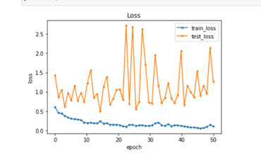
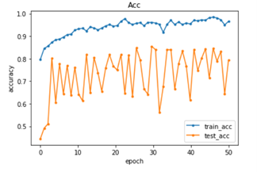
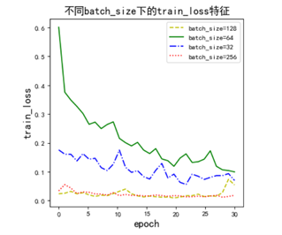
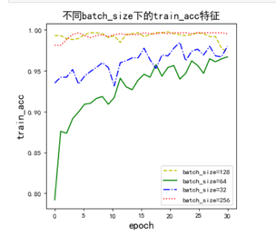
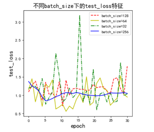
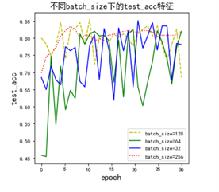

# **1. 研究主题及目的**
实现车辆的分类，从训练时间、预测精度、Loss变化等角度分析实验结果。并对不同超参数进行修改并对比分析（包括卷积层数、卷积核大小、batchsize、lr等）。
# **2. 实验环境和数据来源**
实验环境：Python 3.6，操作系统环境：win10  CPU  torch1.6.0

数据集：①车辆分类数据；共计1358张车辆图片；分别属于汽车、客车和货车三类，其中汽车779张，客车218张，货车360张，各图片大小不一，需要将图片拉伸到相同大小。
# **3. 模型搭建和训练**
首先，定义一个三层卷积，图片先经过三层卷积，shape(batch_size,C_out,H,W)，使用平均池化层将图片变为batch_size*128*1*1，将变量out压缩为batch*128 ，最后进入全连接层，输出3维度，判断汽车是属于汽车、客车还是货车。模型训练过程中，要保证训练集和验证集的loss。
# **4. 预测结果**
用训练好的模型在数据集上进行实验。损失函数迭代效果如图1。

卷积精准度迭代效果如图2。

结果分析：首先在迭代耗时上相对于有较大的优势，耗时较少。其次在顺势函数和预测精度上也相比于手动实现都要效果好，精准度可以达到80％以上。
# **5. 不同超参数的对比分析**
对batchsize进行改变，来验证参数的改变对训练模型的影响。数据的输入和上边的实验数据是相同的。Batchsize分别设计128，64，32，256进行比较。

训练集不同类型batchsize损失函数迭代过程如图3。

训练集不同类型batchsize精准度迭代过程如图4。

测试集不同类型batchsize损失函数迭代过程如图5。

测试集不同类型batchsize精准度迭代过程如图6。

分析：不同的batchsize对应的损失和精准度迭代过程是有区别的。当batchsize越大即图像输入越大则迭代效果越好。精准度也越来越高。测试集和训练集都表现出相同的规律。
# **6. 总结**
1. 一定的数据规模下，增加网络深度能够有效提升网络的性能；两个3x3Conv的感受野等效于1个5x5Conv，并且参数更少，性能更好。
2. torch.nn自身的封装效果相对于人工构造，在精准度和运行时间上具有较大的优势。

